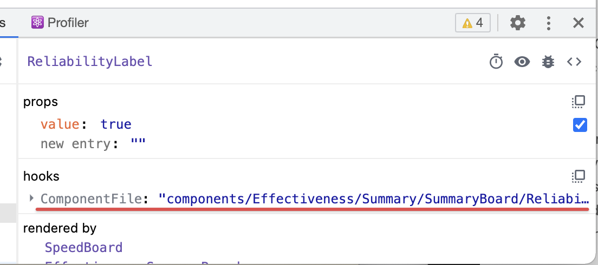

本章节会简单地介绍各个环节的配置，你可以从这里发现`reSKRipt`做的工作和带来的功能，不过我们也不保证这里说明的和最新的实现是完全同步的。

**并且，我们不希望你依赖这边描述的内部配置来实现业务，我们不确定每次更新不会影响内部的逻辑。**

## Babel相关

### core-js

默认使用`useBuiltins: 'usage'`来引入`core-js`，你需要自行安装`core-js`的`3.x`版本。

### 组件名称

所有的React组件会给加上`displayName`，支持函数定义形式的组件，任何函数定义名称为`PascalCase`均被认为是组件：

```tsx
function FooBar() {
    return <div />;
}
```

组件的`displayName`会以函数名为准。

### 组件源码路径

在进行应用调试时，经常会遇到这样一个情况：虽然找到了一个React组件，但一时对应不上哪个源代码文件里实现了这个文件。考虑到组件层级较深时，经常有一些局部使用的同名组件，比如大家都叫Content，就很尴尬，用displayName也不容易定位。

为此`reSKRipt`在开发模式下会为每一个组件注入一些代码，你可以在React Devtools中看到这个组件对应的源码文件：



:::note
所有与组件相关的额外能力，均只支持函数定义形式的组件，即`function FooBar() {}`的形式。其它如函数表达式、箭头函数都均不支持。
:::

### 语法支持

支持以下新语法：

- `export Foo from './Foo'`
- `export {Foo} from './Foo'`
- `const foo = obejct.foo ?? 'default'`
- `1_234_567`
- `object?.foo?.bar`
- `const result = array |> unique |> compact |> flatten`
- `const valid = input.isValid() || throw new Error('Invalid')`

### 代码删减

对`lodash`和`antd`的引入会做优化处理，转成只引入用到的部分。

在`mode=production`的情况下，会把组件的`propTypes`删掉。

## Webpack相关

### 缓存

无论是`build`还是`dev`，都会把缓存写到文件系统中（这可以让`skr dev`打开无比迅速），以下内容会参与到缓存的key的计算中：

- `package.json`的内容。
- `reskript.config.{mjs|ts}`的内容。
- `package-lock.json`或`node_modules/.yarn-integrity`的内容。
- `.browserslistrc`的内容。
- 执行的命令，即`build`或`dev`之类的。
- 当前的`mode`，即`production`或`development`。
- 当前的包名，即`package.json`中的`name`字段。
- 当前的目录，即`process.cwd()`。

缓存会放在`node_modules/.cache/webpack`下，以`{command}-{mode}`命名，比如`dev-server-development`。

在`build`命令时，文件的哈希用来校验该文件是否变更（比较慢），而在`dev`时则用文件的时间戳（比较快）。这么做是因为CI/CD环境会每次都全新`git clone`一份代码，导致时间戳总是不一样的，没办法用上缓存。

### 文件支持

只认`.js`、`.jsx`、`.ts`、`.tsx`、`.d.ts`这几类文件作为脚本。

引入包时的主字段的顺序是`browser -> module -> main`，所以浏览器兼容的实现会被优先引入。

设置了`@/`别名指向`src/`。

### 环境变量

`process.env`中的所有内容都通过`DefinePlugin`注入了，可以直接以`process.env.FOO_BAR`的形式来使用。

在[特性矩阵](../settings/feature-matrix)中有说过，所有声明在`reskript.config.{mjs|ts}`里的`featureMatrix`中的东西，都可以用`$features.fooBar`来拿到，这也是用`DefinePlugin`来实现的。

另外你还能用`$build.`前缀来拿到当前构建的一些元信息，这个元信息的结构大致如下：

```ts
interface BuildInfo {
    mode: 'production' | 'development';
    version: string; // 有git的情况下是git的commit
    target: string; // 对应特性名称
    time: string; // 触发的时间，ISO格式
}
```

**你不能直接用`$build`对象哦，必须用`$build.version`这样的常量才会被替换**。

### 严格模式

在`skr build`和`skr dev`中使用`--strict`参数后，会进入严格模式，严格模式下将额外增加以下检测：

1. 会检查`import`中路径大小写是否正确，即便你是大小写不敏感的操作系统（比如Windows和macOS），也会检查出来。
2. 全局禁用`require.ensure`、`require.context`、`require.include`方法，即不再支持CommonJS的动态依赖。
3. 如果你的当前目录有`tsconfig.json`文件，则会进行类型检查。**这一功能仅在`skr build`时生效，`skr dev`默认关闭**。

### 其它优化

对于`moment`的本地化语言包有特殊处理，会只引入`en`和`zh-CN`两个，所以你要支持其它语言就比较折腾了，可以提个issue来问。

`react`和`react-dom`会根据当前的`mode`选择不同的文件，算是非常标准的优化项。

如果`src/service-worker.js`中有``self.__WB_MANIFEST`字样，使用[workbox-webpack-plugin](https://developers.google.com/web/tools/workbox/modules/workbox-webpack-plugin)的`InjectManifest`注入资源路径。

会自动向生成的HTML中注入`navigator.serviceWorker.register`相关的代码。

## 调试服务器

### 文件监听

当`reSKRipt`配置文件有变化（实际内容有变化）时，服务器会重启。因为这个变化基本肯定也会影响缓存的key，所以这次重启是比较慢的，请耐心等待。

`node_modules`下的东西默认不监听变化，有需要的请参考[配置的文档](../settings/dev-server#监听第三方代码变更)来修改配置。记得调试完第三方包后改回去，不然内存爆炸。

### History API

虽然`reSKRipt`[支持多入口](./multiple-entry)，但在调试的时候默认只能拿到`index`这个入口。

如果你要访问其它入口，可以`/assets/xxx-stable.html`这样来访问，但至于这会不会让路由出错，也不好说了。

现在没找到一个很好的办法支持多入口又能完美使用History API，有啥办法欢迎在issue中指出。
