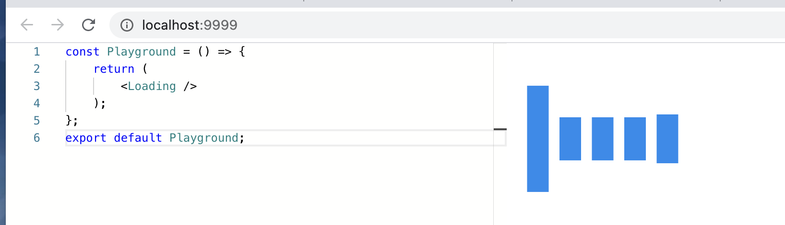
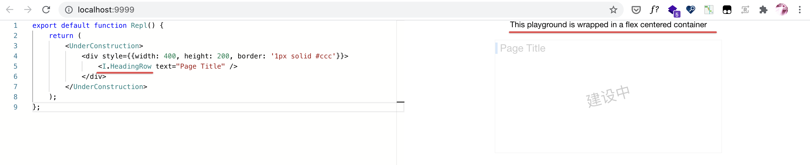
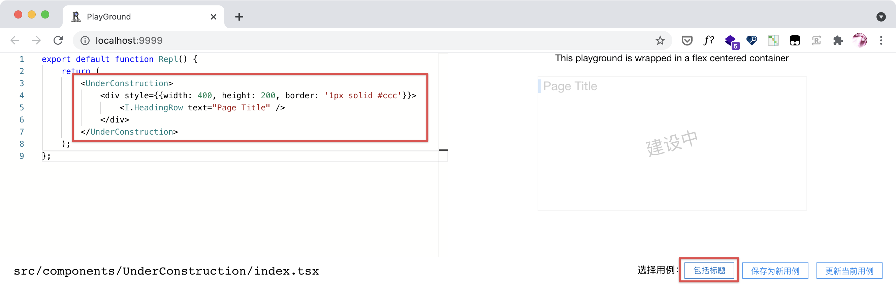

在一个比较复杂的应用的开发中，有时候我们希望针对其中一个组件做些调试，但写一个干净的页面保留一个组件比较麻烦，这时我们可以使用`skr play`功能来将单个组件抽取出来并打开一个可互动的调试界面。

## 使用方法

首先安装上`@reskript/cli-play`：

```shell
npm install --save-dev @reskript/cli-play`
```

你需要`react`和`react-dom`才能够运行，当然相信你都有需要调试的组件了，这些最基本的依赖肯定是安装上了的。

指定你要调试的组件的文件，比如我们想调试一个简单的`src/components/Loading`组件，便可以这样：

```shell
skr play src/components/Loading/index.tsx
```

你可以参阅[命令行 - 调试单个组件](../cli/play)了解命令行上可用的参数，或参考[配置 - 单组件调试配置](../settings/play)了解在`reskript.config.{mjs|ts}`中用作单组件调试的各项配置。

等待一段时间，命令行中会显示出调试服务器的信息：

```
 DONE  Compiled successfully in 1278ms

 I  Your application is running here: http://localhost:9999/
```

调试服务器会固定在`9999`端口打开，在浏览器中打开`http://localhost:9999`就能看到互动式的调试页面：



## 调整组件

你可以在左侧的编辑器中直接使用组件，可以给组件添加一些属性，右侧会展示相应的效果。

在互动界面上，输入会有500毫秒的防抖效果，所以你在输入完后需要等待一小段时间，才能在右侧看到变化。

另外，热更新也是默认支持的，你可以修改`src/components/Loading/index.tsx`文件的内容，浏览器中会自动刷新。

如果组件需要发请求，那么`reskript.config.{mjs|ts}`中的`devServer`中代理API相关的配置也会地生效，可以正常地把请求代理给后端服务。

## 组件调试配置

对于任意一个组件，可以在其文件所在的目录下创建一个`__repl__/{file}.play.js`的文件，比如这样的目录结构：

```
/src
    /components
        /Loading
            /__repl__
                index.play.js
            index.tsx
```

这个文件将用于组件通过`skr play`调试时的上下文配置。每一个配置文件可以导出`wrapper`和`provides`两个变量，以下是一个示例：

```tsx
import HeadingRow from '@/components/HeadingRow';

export const provides = {
    HeadingRow,
};

const flexCenterStyle = {
    display: 'flex',
    alignItems: 'center',
    justifyContent: 'center',
    flexDirection: 'column',
    gap: 20,
};

export function Wrapper({children}) {
    return (
        <div style={flexCenterStyle}>
            <p>This playground is wrapped in a flex centered container</p>
            {children}
        </div>
    );
}
```

配合这个配置，打开调试界面并输入一些代码后，你可以看到类似这样的界面：



:::note
你也可以[通过配置文件](../settings/play#全局配置)来提供全局的调试配置。
:::

### 向调试环境提供额外依赖

配置文件中的`provides`是一个对象，这个对象的中的内容均可以通过`I.*`访问，如上的配置提供了`HeadingRow`这一组件，则对应图中使用`<I.HeadingRow text="Page Title" />`可以直接使用这个组件。

`provides`对象可以提供任何内容，包括并不限于项目内的其它模块和组件、第三方的包和函数（如`ramda`）、硬编码的常量、帮助调试的额外组件等。这些代码会最终通过webpack被编译在调试环境中，与你项目本身的代码无异。

:::note
不过`React`这东西并不需要通过`provides`来注入，在调试环境中默认注入了`React`这个全局变量，你可以直接使用`React.useState`、`React.createElement`等。
:::

### 自定义调试预览的布局

有些组件会依赖特定的布局，如组件本身带有`grid-area`样式，必须在一个`display: grid`的容器内才能正确展示。此时可以通过配置文件中导出`Wrapper`组件自定义预览的布局。

`Wrapper`组件仅接受一个`children`属性，你可以在其外部增加结构。如上面的示例代码会将预览包含在一个居中的容器中，并额外增加一段文本。

同样地，`Wrapper`也可以依赖于项目内、第三方的任何可编译内容，只需要在配置文件中写好`import`引入这些依赖即可。

## 管理调试用例

在一个严谨的工程项目中，我们会希望对组件的调试、测试过程能被保留下来，用于后续修改代码后的二次验证，从而确保代码本身的高质量。`skr play`在提供单个组件的调试能力的同时，也提供了一套管理用例的方案，其特点在于：

1. 通过人类可读的结构管理用例，使用markdown格式。
2. 将处于调试现场的浏览器页面与用例打通，可实时、零成本地保存调试现场到用例。
3. 可以将旧的用例填充到调试现场，并在此基础上进行交互验证。

### 了解用例文件

对于任意一个组件，在其目录下可以放置一个`__repl__/{file}.case.md`文件用来保存用例，比如这样的目录结构：

```
/src
    /components
        /Loading
            /__repl__
                index.case.md
            index.tsx
```

每一个用例文件是一个标准的markdown文件，支持[github flavored markdown](https://github.github.com/gfm/)格式。

:::note
建议不要去手动创建这个文件，当你在界面上保存用例时，文件会自动按正确的格式创建。
:::

在文件中，每一个二级标题（`## title`）对应一个用例名称，在这个二级标题下面的内容中，最后一个语言指定为`jsx`的代码块是这个用例对应的代码，其它内容则被视为用例的补充说明。参考这样一个文件：

```markdown
# UnderConstruction reSKRipt Play Case

## 内容包括标题

- Create: 2021-07-05 10:39:56 (otakustay)
- Run: 2021-07-05 10:42:46 (otakustay)

这个示例包含了头部，看一下头部标题左侧的色块是否能被半透明盖住。

\`\`\`jsx
export default function Repl() {
    return (
        <UnderConstruction>
            <div style={{width: 400, height: 200, border: '1px solid #ccc'}}>
                <I.HeadingRow text="Page Title" />
            </div>
        </UnderConstruction>
    );
}
\`\`\`

## 空内容

- Create: 2021-07-05 10:39:56 (otakustay)
- Run: 2021-07-05 10:42:46 (otakustay)

没有内容时的尺寸是否正确。理应看不到任何东西。

\`\`\`jsx
export default function Repl() {
    return <UnderConstruction />;
}
\`\`\`
```

这个文件声明了2个用例，名字分别为“内容包括标题”和“空内容”，分别对应用例的创建和执行时间、一些简短的说明和一段代码。

你可以手动编辑这个markdown文件管理用例，也可以在调试现场来联动它。

:::caution
在为用例编写描述时，必须在创建和执行时间**后面**追加内容，否则会导致用例文件的解析出现问题。
:::

### 选择用例

在`skr play`对应的界面中，你可以看到底部有一个“选择用例”的下拉框，通过点击它可以选择在markdown文件中存储的用例，选择一个用例后，左侧的代码就会变成对应的调试代码，你可以快速查看右侧预览效果，进行一些交互来确定新的代码是否对这一用例产生影响。



### 保存用例

当你在调试页面通过修改一些代码确定效果后，你可以把当前的代码保存为一个用例。点击下方的“保存为新用例”，`skr play`会自动为你在markdown用例文件中增加一部分内容，用例的名称默认为创建时间，你可以在markdown中修改名称并进一步补充说明。

<video controls playsinline muted width="100%">
    <source src={require('./assets/play-save-case.mp4').default} type="video/mp4" />
</video>

通过在现场保存用例，我们可以把具有典型性的调试代码留存下来，在后续代码修改后进行反复的验证。

### 更新用例

与保存用例类似，当你已经选中了一个用例并修改其代码之后，你可以选择通过“保存为新用例”按钮创建一个新的用例，也可以通过“更新当前用例”按钮修改当前用例的代码。

当点击“更新当前用例”时，markdown中对应的代码片段会被更新。
